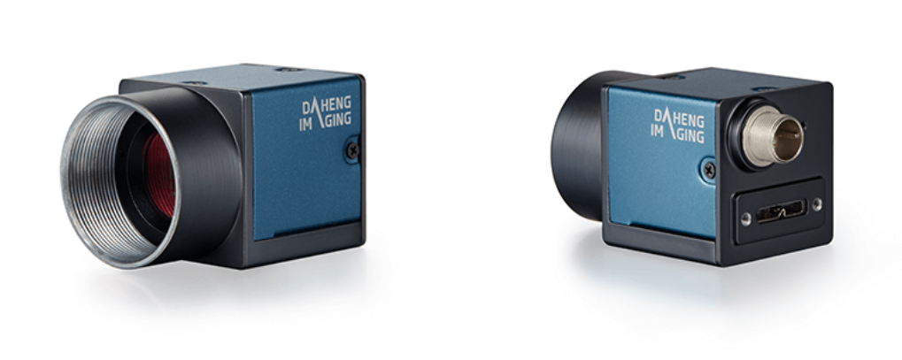

# Daheng MER2-2000-19U3C CMOS Camera

The MERCURY2 USB3.0 series (MER2-U3) camera is DAHENG IMAGING's new generation area scan industrial digital camera, featuring outstanding performance, compact design and extremely low noise. The MER2-2000-19U3C camera is a color USB3 Vision camera with the Sony IMX183 CMOS sensor. Thanks to the compact design (29mm × 29mm × 29mm), robust metal housings and locking screw connectors, the MERCURY2 cameras can secure the reliability of cameras deployed in harsh environments. The MER2-2000-19U3C camera has opto-isolated I/Os. The GPIOs give MER2-U3 cameras maximum flexibility to adapt to specific needs. The MERCURY2 family cameras are especially suitable for machine vision applications such as industrial inspection, medical, scientific research, education, security and so on.

[Source](https://en.daheng-imaging.com/show-106-1999-1.html)